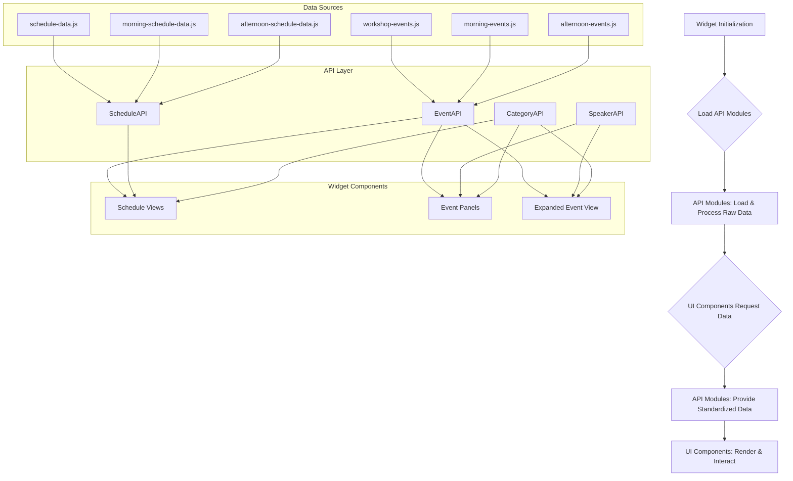

# EVENT AND SCHEDULE DETAILS API

## Centralized Data Management System for NZGDC Widget

---

## 🎯 PURPOSE AND OBJECTIVE

This API specification defines a centralized data management system for the NZGDC Widget ecosystem. The goal is to provide a unified, granular interface for accessing event details, schedule information, speaker bios, and audience group data across all widget components, including Schedule Views, Event Panels, and Expanded Event Views.

By creating dedicated API layers for different data domains, we aim to:

- Ensure consistent data access patterns and reduce redundancy in data handling.
- Provide a scalable and robust foundation for future enhancements.
- Improve data consistency and reduce redundancy across different widget types.
- Simplify data access and manipulation for UI components.
- Decouple the data layer from the presentation layer, enhancing maintainability and testability.

### Key Benefits

- **Centralized Data Access**: Single point of access for all event and schedule information.
- **Consistent Data Structures**: Standardized data formats across all widget components.
- **Enhanced Performance**: Efficient data retrieval and potential for caching mechanisms.
- **Scalability**: Extensible architecture to accommodate future data sources and features.
- **Maintainability**: Simplified data management and updates through clear domain separation.

---

## 📋 CURRENT STATE ANALYSIS

### ✅ What Already Exists

- **Dispersed Event Data:** Event details are currently spread across multiple JavaScript files:
  - `js/workshop-events.js` (for Thursday workshops)
  - `js/morning-events.js` (for Friday/Saturday morning sessions)
  - `js/afternoon-events.js` (for Friday/Saturday afternoon sessions)
- **Dispersed Schedule Data:** Schedule structures are also in separate files:
  - `js/schedule-data.js` (for Thursday)
  - `js/morning-schedule-data.js` (for Friday/Saturday morning)
  - `js/afternoon-schedule-data.js` (for Friday/Saturday afternoon)
- **Basic Event Information:** Existing event data includes `title`, `speakers` (with `name` and `position`), `category`, `categoryKey`, `timeframe`, and `thumbnail`.
- **Schedule Structure:** Schedule data defines `timeSlots`, `timeRange`, `title`, `theme`, and references events by `id` and `type` (e.g., 'big', 'main').
- **`UnifiedEventLoader`:** This component already handles some common logic for creating event panels and mapping basic event data.
- **`ExpandedEventDetailsManager`:** This component currently adapts data on the fly, but would benefit from a standardized input.

### 🚨 What's Missing

- **Single Source of Truth:** No centralized repository for all event and schedule data. Data is loaded directly by individual generators/loaders.
- **Standardized Data Access:** No dedicated API layer for querying event or schedule information.
- **Comprehensive Speaker Details:** Existing speaker data is limited to `name` and `position`. Full `bio`, `email`, `website`, and `headshot` are not consistently available or integrated.
- **Audience Group Tags:** The concept of `audienceTags` is present in the `EXPANDED_EVENT_DETAILS_INTEGRATION_PLAN.md` but not yet integrated into the core event data structures.
- **Clear Data Layer Separation:** UI components directly import and access raw data files, leading to tighter coupling.
- **Granular Data Access:** No dedicated APIs for specific data domains like Speakers or Categories.

---

## 🏗️ PROPOSED ARCHITECTURE

The core of this plan is the introduction of dedicated API modules that will abstract and centralize all event, schedule, speaker, and category information.

### Core Components

1.  **`js/event-api.js` (NEW):** Provides methods for accessing and querying event details.
2.  **`js/schedule-api.js` (NEW):** Provides methods for accessing and querying schedule structures.
3.  **`js/speaker-api.js` (NEW):** Provides methods for accessing and querying speaker details.
4.  **`js/category-api.js` (NEW):** Provides methods for accessing and querying category details.
5.  **Consolidated Internal Data Store:** Within these API modules, all raw event and schedule data from the existing separate files will be loaded and transformed into unified, standardized formats.
6.  **Existing UI Components:**
    - `js/unified-event-loader.js`
    - `js/schedule-generator.js`
    - `js/morning-schedule-generator.js`
    - `js/afternoon-schedule-generator.js`
    - `js/expanded-event-details-manager.js`
      These components will be updated to fetch all necessary data exclusively from the new API modules.

### Integration Flow



---

## 📊 DATA STRUCTURES (API Schemas)

### `Event` Object (Standardized Format)

This comprehensive structure will be the output of `EventAPI.getEvent()`.

```javascript
{
  id: string,                    // Unique event identifier (e.g., "workshop-a1", "panel-b1")
  category: string,              // Display category name (e.g., "Story & Narrative")
  categoryKey: string,           // Standardized category key (e.g., "STORY_NARRATIVE")
  title: string,                 // Event title
  timeframe: string,             // Duration (e.g., "3 hours", "50 minutes")
  thumbnail: string | null,      // Thumbnail image URL (optional)
  description: string,           // Detailed event description (optional, currently limited in raw data)
  audienceTags: string[],        // Audience group tags (e.g., ["WRITERS", "EVERYONE"]) (optional, currently limited in raw data)
  sessionId: string | null,      // Session identifier for grouping (optional, for future use)
  location: string | null,       // Physical location or virtual platform (optional, for future use)
  startDate: Date | null,        // Event start datetime (optional, for future use)
  endDate: Date | null,          // Event end datetime (optional, for future use)
  speakers: Speaker[],           // Array of speaker objects (references SpeakerAPI)
  prerequisites: string[],       // Required knowledge or materials (optional, for future use)
  materials: string[],           // Provided materials or resources (optional, for future use)
  registration: {                // Registration information (optional, for future use)
    required: boolean,
    link: string,
    deadline: Date | null
  } | null
}
```

### `Speaker` Object Structure

```javascript
{
  id: string,                    // Unique speaker identifier (derived from name, or assigned)
  name: string,                  // Full speaker name
  position: string,              // Title and company (e.g., "Lead Writer at GameStudio")
  bio: string,                   // Detailed speaker biography (optional, currently limited in raw data)
  headshot: string | null,       // Headshot image URL (optional, currently limited in raw data)
  email: string | null,          // Contact email (optional, currently limited in raw data)
  website: string | null,        // Personal or company website (optional, currently limited in raw data)
  socialMedia: {                 // Social media links (optional, for future use)
    twitter: string | null,
    linkedin: string | null,
    github: string | null
  } | null,
  expertise: string[],           // Areas of expertise (optional, for future use)
  events: EventReference[],      // Events this speaker participates in (populated by SpeakerAPI)
  featured: boolean,             // Featured speaker status (optional, for future use)
  tags: string[]                 // Custom tags for filtering (optional, for future use)
}
```

### `Schedule` Object (Standardized Format)

This structure will be the output of `ScheduleAPI.getSchedule()`.

```javascript
{
  id: string,                    // Schedule identifier (e.g., "thursday", "friday-morning", "saturday-afternoon")
  title: string,                 // Schedule title (e.g., "Thursday Workshop Schedule")
  date: Date | null,             // Schedule date (optional, for future use)
  timeSlots: TimeSlot[],         // Array of time slot objects
  venue: string | null,          // Venue information (optional, for future use)
  timezone: string | null,       // Timezone information (optional, for future use)
  notes: string[]                // General schedule notes (optional, for future use)
}
```

### `TimeSlot` Structure

```javascript
{
  id: string,                    // Unique time slot identifier
  timeRange: string,             // Display time range (e.g., "10.00am - 10.30am")
  title: string,                 // Time slot title (e.g., "Early Morning Panels")
  theme: string,                 // Styling theme (e.g., "early", "mid", "a", "b")
  type: "event" | "break",       // Slot type
  events: EventReference[],      // Array of event references (for event slots)
  description: string | null,    // Description (for break slots) (optional, for future use)
  duration: number | null,       // Duration in minutes (optional, for future use)
  backgroundColor: string | null,// Custom background color (optional, for future use)
  textColor: string | null       // Custom text color (optional, for future use)
}
```

### `EventReference` Structure

Used within `TimeSlot` to link to full `Event` objects.

```javascript
{
  id: string,                    // Event ID reference
  category: string,              // Event category for display (redundant, but useful for quick display)
  title: string,                 // Event title (redundant, but useful for quick display)
  type: "big" | "main"           // Panel type for styling
}
```

### `Category` Object Structure

```javascript
{
  key: string,                   // Standardized key (e.g., "STORY_NARRATIVE")
  name: string,                  // Display name (e.g., "Story & Narrative")
  description: string | null,    // Category description (optional, for future use)
  color: string | null,          // Primary color for UI (optional, for future use)
  brightness: "light" | "dark",  // Text brightness for contrast (derived from existing data)
  icon: string | null,           // Category icon identifier (optional, for future use)
  tags: string[],                // Associated audience tags (optional, for future use)
  featured: boolean,             // Featured category status (optional, for future use)
  sortOrder: number | null       // Display order (optional, for future use)
}
```

---

## 🔌 API METHODS

### `EventAPI` Methods

- **`EventAPI.getEvent(eventId: string): Event | null`**: Returns a standardized `Event` object for a given ID.
- **`EventAPI.getAllEvents(): Event[]`**: Returns an array of all standardized `Event` objects.
- **`EventAPI.getEventsByCategory(categoryKey: string): Event[]`**: Returns an array of `Event` objects filtered by category key.
- **`EventAPI.getEventsBySpeaker(speakerId: string): Event[]`**: Returns events associated with a specific speaker ID.
- **`EventAPI.searchEvents(query: string): Event[]`**: Searches events by title or description.
- **`EventAPI.getFeaturedEvents(): Event[]`**: Returns a list of featured events (for future use).

### `ScheduleAPI` Methods

- **`ScheduleAPI.getSchedule(scheduleId: string): Schedule | null`**: Returns a standardized `Schedule` object for a given ID (e.g., "thursday", "friday-morning", "saturday-afternoon").
- **`ScheduleAPI.getAllSchedules(): Schedule[]`**: Returns an array of all standardized `Schedule` objects.
- **`ScheduleAPI.getTimeSlots(scheduleId: string): TimeSlot[]`**: Returns time slots for a specific schedule.
- **`ScheduleAPI.getEventsForTimeSlot(scheduleId: string, timeSlotId: string): EventReference[]`**: Returns event references for a specific time slot.
- **`ScheduleAPI.getScheduleWithFullEvents(scheduleId: string): Schedule`**: Returns a schedule object where `EventReference` objects within `TimeSlot` are replaced with full `Event` objects.

### `SpeakerAPI` Methods

- **`SpeakerAPI.getSpeaker(speakerId: string): Speaker | null`**: Returns a standardized `Speaker` object for a given ID.
- **`SpeakerAPI.getAllSpeakers(): Speaker[]`**: Returns an array of all standardized `Speaker` objects.
- **`SpeakerAPI.getSpeakersByEvent(eventId: string): Speaker[]`**: Returns speakers participating in a specific event.
- **`SpeakerAPI.getSpeakersByExpertise(expertise: string): Speaker[]`**: Returns speakers with a specific area of expertise (for future use).
- **`SpeakerAPI.getFeaturedSpeakers(): Speaker[]`**: Returns a list of featured speakers (for future use).

### `CategoryAPI` Methods

- **`CategoryAPI.getCategory(categoryKey: string): Category | null`**: Returns a `Category` object for a given key.
- **`CategoryAPI.getAllCategories(): Category[]`**: Returns an array of all `Category` objects.
- **`CategoryAPI.getCategoriesWithEventCounts(): CategoryWithCount[]`**: Returns categories along with the count of events in each (for future use).
- **`CategoryAPI.getAudienceTagsForCategory(categoryKey: string): string[]`**: Returns associated audience tags for a category (for future use).

---

## 🔧 IMPLEMENTATION PLAN

### PHASE 1: API Module Definition & Data Consolidation

**Step 1.1: Define Standardized Data Structures (in code)**
Implement the `Event`, `Speaker`, `Schedule`, `TimeSlot`, `EventReference`, and `Category` interfaces/types in a central location (e.g., `js/types.js` or directly within API modules).

**Step 1.2: Create `js/event-api.js`**

- **Responsibilities:** Load `WORKSHOP_EVENTS`, `MORNING_EVENTS`, `AFTERNOON_EVENTS`.
- **Data Transformation:** Consolidate and transform raw event data into the standardized `Event` format. Assign unique `id` to speakers if not already present.
- **Methods:** Implement `getEvent`, `getAllEvents`, `getEventsByCategory`, `searchEvents`. (Other methods can be added in later phases).

**Step 1.3: Create `js/schedule-api.js`**

- **Responsibilities:** Load `SCHEDULE_DATA`, `MORNING_SCHEDULE_DATA`, `AFTERNOON_SCHEDULE_DATA`.
- **Data Transformation:** Consolidate and transform raw schedule data into the standardized `Schedule` and `TimeSlot` formats. Ensure `EventReference` objects correctly link to `Event` IDs.
- **Methods:** Implement `getSchedule`, `getAllSchedules`, `getTimeSlots`, `getEventsForTimeSlot`.

**Step 1.4: Create `js/speaker-api.js`**

- **Responsibilities:** Aggregate speaker data from all `Event` objects provided by `EventAPI`.
- **Data Transformation:** Create unique `Speaker` objects, consolidating details and linking them to events.
- **Methods:** Implement `getSpeaker`, `getAllSpeakers`, `getSpeakersByEvent`.

**Step 1.5: Create `js/category-api.js`**

- **Responsibilities:** Aggregate category data from all `Event` objects provided by `EventAPI`.
- **Data Transformation:** Create unique `Category` objects, including `brightness` based on existing `UnifiedEventLoader` logic.
- **Methods:** Implement `getCategory`, `getAllCategories`.

### PHASE 2: Integration with Existing Components

**Step 2.1: Update Schedule Generators**

- **Files:** `js/schedule-generator.js`, `js/morning-schedule-generator.js`, `js/afternoon-schedule-generator.js`
- **Changes:**
  - Import and use `ScheduleAPI` to fetch schedule structures (e.g., `ScheduleAPI.getSchedule('thursday')`).
  - Import and use `EventAPI` to fetch individual event details (e.g., `EventAPI.getEvent(eventId)`) before passing them to `UnifiedEventLoader.createEventPanel()`.
  - Update `filterEventsByCategory` to use `EventAPI.getEventsByCategory()` or to filter based on `categoryKey` obtained from `CategoryAPI`.

**Step 2.2: Update `UnifiedEventLoader.js`**

- **File:** `js/unified-event-loader.js`
- **Changes:**
  - `createEventPanel` will now expect to receive a fully standardized `Event` object from its caller (a Schedule Generator). It will no longer perform its own data lookups or extensive mapping from raw data.
  - Update `validateCategoryData`, `getCategoryBrightness`, and `getCategoryDisplayName` to utilize `CategoryAPI.getCategory()` for category information.
  - Remove direct dependencies on `window.WORKSHOP_EVENTS`, `window.MORNING_EVENTS`, `window.AFTERNOON_EVENTS`.

**Step 2.3: Update `ExpandedEventDetailsManager.js`**

- **File:** `js/expanded-event-details-manager.js`
- **Changes:**
  - The `showEventDetails` method should now expect to receive a fully standardized `Event` object directly from `UnifiedEventLoader` (which itself received it from a Schedule Generator, which received it from `EventAPI`).
  - Simplify or remove the internal `adaptEventData` and `adaptSpeakerData` methods, as the input will already be in the desired format.
  - Ensure `extractAudienceTags` and `getAudienceTagClass` are compatible with the new standardized `Event` structure.

### PHASE 3: Data Enrichment (Post-API Implementation)

- **Update Raw Data Files:** Once the API is in place, systematically update `workshop-events.js`, `morning-events.js`, and `afternoon-events.js` to include the new `description`, `bio`, `email`, `website`, `headshot`, and `audienceTags` fields. This ensures the API provides rich, complete data.

---

## 🔄 API INTEGRATION PATTERNS

### Widget Integration Examples

#### Schedule View Integration (`js/schedule-generator.js`)

```javascript
// In ScheduleGenerator.renderSchedule(scheduleId)
import { ScheduleAPI } from './schedule-api.js';
import { EventAPI } from './event-api.js';

const scheduleData = ScheduleAPI.getSchedule(scheduleId);
if (scheduleData) {
  scheduleData.timeSlots.forEach(slot => {
    if (slot.type === 'event') {
      slot.events.forEach(eventRef => {
        const fullEventData = EventAPI.getEvent(eventRef.id);
        // Pass fullEventData to UnifiedEventLoader.createEventPanel
      });
    }
    // ... handle break slots
  });
}

// In ScheduleGenerator.filterEventsByCategory(categoryKey)
import { EventAPI } from './event-api.js';
// Get all events for the current schedule and filter them
const allEventsInSchedule = EventAPI.getAllEvents().filter(event =>
  // Check if event is part of the current schedule's time slots
  // and then filter by categoryKey
);
```

#### Event Panel Integration (`js/unified-event-loader.js`)

```javascript
// In UnifiedEventLoader.createEventPanel(eventData, eventType, widgetType)
// eventData is already a full, standardized Event object from EventAPI
// No need for internal data lookups or extensive mapping here.
// Example of accessing speaker data:
const speakerName = eventData.speakers[0]?.name || "Speaker Name";
const speakerPosition = eventData.speakers[0]?.position || "Position + Company";
// ... use eventData.description, eventData.audienceTags etc.
```

#### Expanded Event View Integration (`js/expanded-event-details-manager.js`)

```javascript
// In ExpandedEventDetailsManager.showEventDetails(eventData, sourceWidget)
// eventData is already a full, standardized Event object passed from UnifiedEventLoader
// No need for adaptEventData or adaptSpeakerData.
this.populateTitle(eventData.title);
this.populateSpeakersList(eventData.speakers); // Speakers array is already rich
this.populateDescription(eventData.description);
this.populateAudienceTags(eventData.audienceTags);
this.populateSpeakerBios(eventData.speakers); // Speaker objects are already rich
```

---

## 📈 PERFORMANCE CONSIDERATIONS

### Data Loading Strategy

- **Initial Load:** All raw data files will be loaded and processed once during the initialization of the API modules. This creates an in-memory cache.
- **Lazy Loading (Future):** For extremely large datasets, consider lazy-loading of specific event details or speaker bios only when requested.
- **Caching:** The API modules will inherently act as a cache, preventing repeated parsing of raw data.
- **Preprocessing:** Data transformation and consolidation will happen once at startup, ensuring subsequent lookups are fast.

### Memory Management

- **In-Memory Store:** The consolidated data will reside in memory. Monitor memory usage to ensure it remains within acceptable limits for the target environments.
- **Reference Management:** Ensure no circular references or unnecessary strong references prevent garbage collection if data is dynamically added/removed (less likely in this read-heavy scenario).

### Optimization Techniques

- **Normalized Data:** Store data in a normalized form within the API modules to reduce duplication and improve consistency.
- **Indexed Lookups:** Use JavaScript Maps or Objects for efficient `id`-based lookups (e.g., `eventsById`, `speakersById`).
- **Minification/Bundling:** The API modules and data files should be minified and bundled as part of the overall build process to reduce file size and network transfer time.

---

## 🔒 SECURITY CONSIDERATIONS

### Data Integrity

- **Validation:** All data inputs (from raw JS files) should be validated against the defined schemas during API initialization to catch malformed data early.
- **Immutability:** Treat the data returned by the API methods as immutable where possible, to prevent accidental modification by consuming components. If modifications are needed, ensure they are explicit and localized.
- **Sanitization:** While this API primarily serves internal components, if any data originates from external, untrusted sources (e.g., user input), ensure proper sanitization to prevent XSS or injection vulnerabilities.

### Access Control

- **Read-Only Access:** The API should primarily provide read-only access to the event and schedule data. No methods for modifying or deleting data should be exposed.
- **No Sensitive Data:** Ensure no sensitive user data or API keys are hardcoded or exposed through this client-side API.

---

## 🚀 DEPLOYMENT CONSIDERATIONS

### Build Process

1.  **Data Bundling:** The raw event and schedule data files, along with the new API modules, should be bundled together into the final widget JavaScript assets.
2.  **Minification:** All JavaScript files should be minified to reduce file size.
3.  **Dependency Management:** Ensure the correct loading order of the API modules and their dependencies. The API modules must initialize before any components attempt to use them.

### Runtime Configuration

- **Environment Detection:** Consider if any API behavior needs to differ between development and production environments (e.g., debug logging).
- **Error Handling:** Implement robust error handling within the API modules to gracefully manage cases where data is missing or malformed, preventing crashes in consuming widgets.
- **Fallbacks:** Provide sensible fallback values or error messages if critical data cannot be loaded or found.

---

## 🧪 TESTING REQUIREMENTS

### Unit Tests

- **API Module Initialization:**
  - Verify correct loading and consolidation of all raw event and schedule data by each API module.
  - Test data transformation into the standardized `Event`, `Schedule`, `Speaker`, and `Category` formats.
- **API Method Functionality:**
  - Test `EventAPI.getEvent()`, `getAllEvents()`, `getEventsByCategory()`, etc., for all event IDs and categories across different raw data sources.
  - Test `ScheduleAPI.getSchedule()`, `getAllSchedules()`, `getTimeSlots()`, etc., for all schedule types.
  - Test `SpeakerAPI.getSpeaker()`, `getAllSpeakers()`, `getSpeakersByEvent()`, etc.
  - Test `CategoryAPI.getCategory()`, `getAllCategories()`.
  - Test edge cases: missing IDs, malformed data in raw sources (how API handles it), empty results.

### Integration Tests

- **Data Source Integration:** Verify that the API modules correctly parse and integrate data from `workshop-events.js`, `morning-events.js`, `afternoon-events.js`, `schedule-data.js`, `morning-schedule-data.js`, `afternoon-schedule-data.js`.
- **Widget Component Integration:**
  - Load a widget (e.g., Thursday, Friday/Saturday).
  - Verify that `ScheduleGenerator`, `UnifiedEventLoader`, and `ExpandedEventDetailsManager` successfully retrieve and display data from the new API modules.
  - Confirm that all existing functionalities (e.g., panel rendering, hover effects, expanded details, filtering) work as expected using the new API.
- **Cross-API Consistency:** Ensure that data retrieved from different APIs (e.g., an event from `EventAPI` and its speakers from `SpeakerAPI`) is consistent.

### End-to-End Tests

- **Functional Tests:** Manually test all widgets (Thursday, Friday/Saturday Morning, Friday/Saturday Afternoon) to ensure full functionality.
  - Verify event panels display correctly.
  - Verify expanded event details open and display all information (title, description, speakers, bios, audience tags).
  - Test category filtering functionality.
- **Cross-Browser Compatibility:** Ensure the API and consuming widgets work correctly across all target browsers.
- **Performance Benchmarks:** Measure initial load times and data retrieval speeds to ensure they meet targets.

---

## ✅ SUCCESS CRITERIA

### Functionality Success

- [ ] Unified access to all event and schedule data through dedicated API modules.
- [ ] Consistent data structures across all widget types, adhering to the defined schemas.
- [ ] All existing widget functionalities (panel rendering, hover effects, expanded details, filtering) work correctly using the new API.
- [ ] Comprehensive search and filtering capabilities are available via API methods.

### Performance Success

- [ ] Fast initial load times for the widget (target: < 2 seconds).
- [ ] Efficient memory usage for the in-memory data store.
- [ ] Responsive API calls (target: < 10ms for direct lookups).

### Integration Success

- [ ] Seamless integration with existing widget components (`ScheduleGenerator`, `UnifiedEventLoader`, `ExpandedEventDetailsManager`).
- [ ] Minimal breaking changes during the transition phase.
- [ ] Comprehensive documentation and examples for future development.

---

## 📚 RELATED DOCUMENTATION

### Implementation Dependencies

- **Event Data Sources**: `js/workshop-events.js`, `js/morning-events.js`, `js/afternoon-events.js`
- **Schedule Configurations**: `js/schedule-data.js`, `js/morning-schedule-data.js`, `js/afternoon-schedule-data.js`
- **Component APIs**: `js/unified-event-loader.js`, `js/expanded-event-details-manager.js`
- **Existing Architecture**: `docs/tasks-drafts/EXPANDED_EVENT_DETAILS_INTEGRATION_PLAN.md`

### Development Resources

- **API Design Patterns**: Principles for designing clean and consistent APIs.
- **Error Handling**: Consistent error handling strategies across modules.
- **Logging**: Structured logging for debugging and monitoring.
- **Modular JavaScript**: Best practices for organizing JavaScript code into modules.

---
