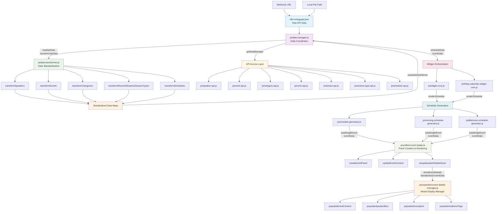

# NZGDC Widget Data Flow Diagram

## Data Flow Summary

This diagram illustrates the systematic data flow in the NZGDC widget system:

1. **Raw Data Ingestion**: Data enters through `n8n-entegyapi.json` via webhook or local file
2. **Centralized Management**: `data-manager.js` serves as the single source of truth
3. **Data Standardization**: `data-transformer.js` processes and cleans the raw data
4. **API Layer**: Specialized API modules provide structured access to standardized data
5. **Widget Orchestration**: Core widget modules initialize the rendering process
6. **Schedule Rendering**: Generator modules build the HTML layout structure
7. **Panel Creation**: Unified loader creates individual event panels with full details
8. **User Interaction**: Expanded details manager handles click events for detailed modals

The dotted lines represent data retrieval and event-driven interactions, while solid lines show the primary data transformation pipeline. This architecture ensures data consistency, modularity, and maintainability across the entire system.