# NZGDC Widget Data Flow Diagram

```mermaid
flowchart TD
    %% Data Sources
    A1[Webhook URL] --> A[n8n-entegyapi.json<br/>Raw API Data]
    A2[Local File Path] --> A
    
    %% ACTUAL IMPLEMENTATION (Used by Widget)
    subgraph ACTIVE ["🟢 ACTIVE DATA FLOW"]
        A --> B[js/data-manager.js<br/>Data Coordinator]
        B --> |loadApiData<br/>transformApiData| C[js/data-transformer.js<br/>Data Standardization<br/>✅ Speaker Field Mapping<br/>displayName → displayName<br/>speakerImage → headshot<br/>web → website]
        
        %% Data Transformation Process
        C --> C1[transformSpeakers<br/>✅ Field prioritization fixed]
        C --> C2[transformEvents]
        C --> C3[transformCategories]
        C --> C4[transformRooms/Streams/SessionTypes]
        C --> C5[transformSchedules]
        
        C1 --> D[Standardized Data Maps<br/>✅ Consistent field mapping]
        C2 --> D
        C3 --> D
        C4 --> D
        C5 --> D
        
        %% Data Storage & Population
        D --> |populateDataStores| B
        
        %% DIRECT DataManager Access (What Actually Happens)
        B --> |DIRECT ACCESS<br/>this.dataManager methods| F[Widget Orchestration]
        F --> F1[js/widget-core.js]
        F --> F2[js/friday-saturday-widget-core.js]
        
        %% Static Data Files (Legacy/Fallback)
        STATIC[js/schedule-data.js<br/>js/workshop-events.js<br/>Static JSON Files] -.-> |FALLBACK fallback| F
        
        %% Schedule Generation
        F1 --> |renderSchedule| G[Schedule Generators]
        F2 --> |renderSchedule| G
        G --> G1[js/schedule-generator.js]
        G --> G2[js/morning-schedule-generator.js]
        G --> G3[js/afternoon-schedule-generator.js]
        
        %% Event Panel Creation
        G1 --> |loadSingleEvent<br/>eventData| H[js/unified-event-loader.js<br/>Panel Creation & Rendering<br/>✅ Speaker field mapping:<br/>displayName → .nzgdc-speaker-bioName-big<br/>displayName → .nzgdc-speaker-name-main<br/>✅ Thumbnail fallback to headshot]
        G2 --> |loadSingleEvent<br/>eventData| H
        G3 --> |loadSingleEvent<br/>eventData| H
        
        %% Panel Content Population
        H --> H1[createEventPanel<br/>✅ Enhanced thumbnail logic]
        H --> H2[updateEventContent<br/>✅ Corrected field priority]
        H --> H3[setupSpeakerDetailsHover]
        
        %% Modal Display
        H3 --> |showEventDetails<br/>standardized eventData| I[js/expanded-event-details-manager.js<br/>Modal Display Manager<br/>✅ Complete speaker mapping:<br/>displayName → .nzgdc-expanded-speaker-name<br/>headshot → .nzgdc-speaker-headshot<br/>email → .nzgdc-contact-email<br/>website → .nzgdc-contact-website]
    end
    
    %% UNUSED API LAYER (Documentation vs Reality)
    subgraph UNUSED ["UNUSED API FILES"]
        E[API Access Layer<br/>DEAD CODE]
        E --> E1[js/speaker-api.js<br/>Not Loaded]
        E --> E2[js/event-api.js<br/>Not Loaded]
        E --> E3[js/category-api.js<br/>Not Loaded]
        E --> E4[js/room-api.js<br/>Not Loaded]
        E --> E5[js/stream-api.js<br/>Not Loaded]
        E --> E6[js/session-type-api.js<br/>Not Loaded]
        E --> E7[js/schedule-api.js<br/>Not Loaded]
    end
    
    %% Show the disconnect
    B -.-> |INTENDED but NOT USED| E
    
    %% Modal Content Population
    I --> I1[populateEventContent]
    I --> I2[populateSpeakerBios<br/>✅ Contact info integration]
    I --> I3[populateDescription]
    I --> I4[populateAudienceTags]
    
    %% Styling
    style A fill:#e1f5fe
    style B fill:#90EE90
    style C fill:#90EE90
    style D fill:#90EE90
    style STATIC fill:#FFE4B5
    style E fill:#FFB6C1
    style E1 fill:#FFB6C1
    style E2 fill:#FFB6C1
    style E3 fill:#FFB6C1
    style E4 fill:#FFB6C1
    style E5 fill:#FFB6C1
    style E6 fill:#FFB6C1
    style E7 fill:#FFB6C1
    style F fill:#90EE90
    style G fill:#90EE90
    style H fill:#90EE90
    style I fill:#90EE90
    style ACTIVE fill:#E0FFE0,stroke:#228B22,stroke-width:2px
    style UNUSED fill:#FFE0E0,stroke:#DC143C,stroke-width:2px,stroke-dasharray: 5 5
```

## Data Flow Summary - ACTUAL vs DOCUMENTED

### 🟢 **ACTUAL IMPLEMENTATION (What Really Happens)**

This diagram reveals the **actual data flow** in the NZGDC widget system versus the documented architecture:

1. **Raw Data Ingestion**: Data enters through `n8n-entegyapi.json` via webhook or local file ✅
2. **Centralized Management**: `data-manager.js` serves as the single source of truth ✅
3. **Data Standardization**: `data-transformer.js` processes and cleans the raw data ✅
   - **✅ Speaker Field Mapping**: Correctly maps `displayName`, `speakerImage` → `headshot`, `web` → `website`
   - **✅ Combined Position Field**: Merges `position` + `company` into display-ready format
4. **~~API Layer~~**: **❌ UNUSED - These files exist but are NOT loaded by the widget loader**
5. **Direct DataManager Access**: Widget cores directly call `this.dataManager.getAllEvents()` etc. ✅
6. **Widget Orchestration**: Core widget modules initialize the rendering process ✅
7. **Schedule Rendering**: Generator modules build the HTML layout structure ✅
8. **Panel Creation**: Unified loader creates individual event panels with full details ✅
   - **✅ Speaker Data Mapping**: `displayName` correctly prioritized over `name` fallback
   - **✅ Thumbnail Fallback**: Uses speaker `headshot` when event thumbnail unavailable
9. **User Interaction**: Expanded details manager handles click events for detailed modals ✅
   - **✅ Complete Contact Integration**: Email and website links with proper protocol handling

### 🔴 **DOCUMENTATION vs REALITY GAP**

The **API layer files** (`speaker-api.js`, `event-api.js`, `category-api.js`, etc.) are:
- **Documented** as essential components providing "structured access to standardized data"
- **Reality**: Complete dead code - not loaded by `nzgdc-schedule-widget-modular.js`
- **Widget cores bypass them entirely** and directly access DataManager methods

### 📊 **Static Data Fallback**

The system also maintains backward compatibility with static JSON files:
- `js/schedule-data.js` and `js/workshop-events.js` 
- Used as fallback when DataManager is not provided
- Legacy approach that's being superseded by the DataManager architecture

### 🏗️ **Architecture Conclusion**

The actual implementation is **more direct and efficient** than documented:
- No unnecessary API abstraction layer
- Direct DataManager access reduces complexity
- Static files provide reliable fallback mechanism
- The transformation pipeline (DataManager → DataTransformer) works as documented

### 🔧 **Recent Improvements (Field Mapping Fixes)**

**✅ Speaker Data Consistency**:
- Fixed `displayName` field prioritization across all components
- Enhanced thumbnail fallback to use speaker headshots
- Proper mapping of API fields to HTML elements:
  - `displayName` → `.nzgdc-speaker-bioName-big`, `.nzgdc-speaker-name-main`, `.nzgdc-expanded-speaker-name`, `.nzgdc-speaker-name-item`
  - `position` (combined) → `.nzgdc-speaker-bioPosition-big`, `.nzgdc-speaker-position-company-main`, `.nzgdc-expanded-speaker-position`
  - `headshot` → `.nzgdc-speaker-headshot` and thumbnail fallbacks
  - `email` → `.nzgdc-contact-email`
  - `website` → `.nzgdc-contact-website`