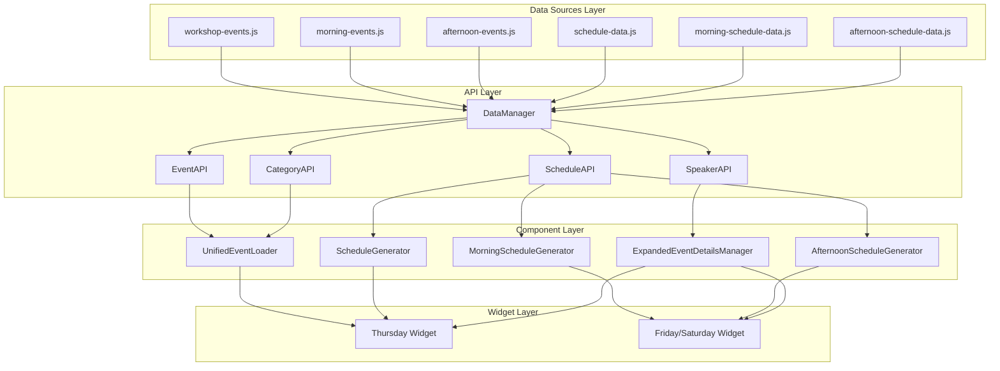

# EVENTS SCHEDULE API ARCHITECTURE PLAN

## Centralized Data Management System for NZGDC Widget

---

## 🎯 EXECUTIVE SUMMARY

This comprehensive architecture plan details the integration of a centralized Events Schedule API system into the existing NZGDC widget codebase. The plan transforms the current dispersed data architecture into a unified, scalable API-driven system while maintaining backward compatibility and minimizing disruption to existing functionality.

The integration will create dedicated API layers for different data domains (Events, Schedules, Speakers, Categories) that will abstract and centralize all event and schedule information, providing consistent data access patterns and reducing redundancy in data handling.

---

## 1. CURRENT ARCHITECTURE ANALYSIS

### 1.1 Existing Data Flow Patterns

**Current State:**

- **Dispersed Data Sources**: Event data scattered across `workshop-events.js`, `morning-events.js`, `afternoon-events.js`
- **Schedule Configuration**: Separate schedule files `schedule-data.js`, `morning-schedule-data.js`, `afternoon-schedule-data.js`
- **Direct Data Access**: Generators directly access `window.WORKSHOP_EVENTS`, `window.MORNING_EVENTS`, `window.AFTERNOON_EVENTS`
- **Tight Coupling**: UI components tightly coupled to raw data structures

### 1.2 Key Integration Points Identified

1. **UnifiedEventLoader**: Central panel creation with category validation
2. **Schedule Generators**: `ScheduleGenerator`, `MorningScheduleGenerator`, `AfternoonScheduleGenerator`
3. **ExpandedEventDetailsManager**: Event data adaptation and display
4. **Category System**: Existing category definitions in `UnifiedEventLoader`
5. **Filtering Logic**: Event filtering in all generators

---

## 2. API MODULE STRUCTURE AND DATA FLOW DESIGN

### 2.1 Core API Architecture



### 2.2 API Module Specifications

#### 2.2.1 DataManager (Core Orchestrator)

**File**: `js/data-manager.js`
**Purpose**: Central data loading, validation, and transformation coordinator

```javascript
class DataManager {
  constructor() {
    this.rawData = {
      events: new Map(),
      schedules: new Map(),
      speakers: new Map(),
      categories: new Map(),
    };
    this.isInitialized = false;
  }

  async initialize() {
    // Load and consolidate all raw data sources
    // Transform into standardized formats
    // Populate internal data stores
    // Validate data integrity
  }

  getEventData() {
    return this.rawData.events;
  }
  getScheduleData() {
    return this.rawData.schedules;
  }
  getSpeakerData() {
    return this.rawData.speakers;
  }
  getCategoryData() {
    return this.rawData.categories;
  }
}
```

#### 2.2.2 EventAPI

**File**: `js/event-api.js`
**Integration Points**:

- `ScheduleGenerator.loadSingleWorkshop()`
- `MorningScheduleGenerator.loadSingleEvent()`
- `AfternoonScheduleGenerator.loadSingleEvent()`

```javascript
class EventAPI {
  static getEvent(eventId) {
    // Replace: window.WORKSHOP_EVENTS[eventId]
    // Replace: window.MORNING_EVENTS[eventId]
    // Replace: window.AFTERNOON_EVENTS[eventId]
  }

  static getAllEvents() {
    // Consolidate all event sources
  }

  static getEventsByCategory(categoryKey) {
    // Replace filtering logic in generators
  }

  static searchEvents(query) {
    // Search events by title or description
  }

  static getFeaturedEvents() {
    // Get featured events for special highlighting
  }

  static getEventsBySpeaker(speakerId) {
    // Get events associated with a specific speaker ID
  }
}
```

#### 2.2.3 ScheduleAPI

**File**: `js/schedule-api.js`
**Integration Points**:

- `ScheduleGenerator.renderSchedule()`
- `MorningScheduleGenerator.renderSchedule()`
- `AfternoonScheduleGenerator.renderSchedule()`

```javascript
class ScheduleAPI {
  static getSchedule(scheduleId) {
    // Replace: window.SCHEDULE_DATA
    // Replace: window.MORNING_SCHEDULE_DATA
    // Replace: window.AFTERNOON_SCHEDULE_DATA
  }

  static getScheduleWithFullEvents(scheduleId) {
    // Populate EventReference objects with full Event data
  }

  static getAllSchedules() {
    // Get all schedules
  }

  static getTimeSlots(scheduleId) {
    // Get time slots for a specific schedule
  }

  static getEventsForTimeSlot(scheduleId, timeSlotId) {
    // Get event references for a specific time slot
  }
}
```

#### 2.2.4 SpeakerAPI

**File**: `js/speaker-api.js`
**Integration Points**:

- `ExpandedEventDetailsManager.adaptSpeakerData()`

```javascript
class SpeakerAPI {
  static getSpeaker(speakerId) {
    // Standardized speaker data access
  }

  static getSpeakersByEvent(eventId) {
    // Replace speaker extraction in ExpandedEventDetailsManager
  }

  static getAllSpeakers() {
    // Get all speakers
  }

  static getFeaturedSpeakers() {
    // Get featured speakers
  }

  static getSpeakersByExpertise(expertise) {
    // Get speakers with a specific area of expertise
  }
}
```

#### 2.2.5 CategoryAPI

**File**: `js/category-api.js`
**Integration Points**:

- `UnifiedEventLoader.validateCategoryData()`
- `UnifiedEventLoader.categoryDefinitions`

```javascript
class CategoryAPI {
  static getCategory(categoryKey) {
    // Replace UnifiedEventLoader.categoryDefinitions access
  }

  static getAllCategories() {
    // Centralized category management
  }

  static getCategoriesWithEventCounts() {
    // Get categories with event counts for filtering
  }
}
```

---

## 3. IMPLEMENTATION PHASES AND DEPENDENCIES

### Phase 1: Foundation Layer (Week 1-2)

**Dependencies**: None
**Deliverables**:

1. **DataManager Implementation**

   - Create `js/data-manager.js`
   - Implement data loading and consolidation logic
   - Add data validation and transformation
   - Create initialization lifecycle

2. **API Module Scaffolding**

   - Create `js/event-api.js`, `js/schedule-api.js`, `js/speaker-api.js`, `js/category-api.js`
   - Implement basic method signatures
   - Add comprehensive JSDoc documentation
   - Create TypeScript definitions (optional)

3. **Data Structure Standardization**
   - Define standardized Event, Schedule, Speaker, Category interfaces
   - Create data transformation utilities
   - Implement validation schemas

### Phase 2: Core API Implementation (Week 3-4)

**Dependencies**: Phase 1 complete
**Deliverables**:

1. **EventAPI Complete Implementation**

   - `getEvent()`, `getAllEvents()`, `getEventsByCategory()`
   - Data consolidation from all event sources
   - Category key normalization
   - Event reference resolution

2. **ScheduleAPI Complete Implementation**

   - `getSchedule()`, `getAllSchedules()`, `getTimeSlots()`
   - Schedule data consolidation
   - EventReference to Event resolution
   - Time slot management

3. **SpeakerAPI and CategoryAPI Implementation**
   - Speaker data aggregation and normalization
   - Category definition centralization
   - Cross-reference management

### Phase 3: Component Integration (Week 5-6)

**Dependencies**: Phase 2 complete
**Deliverables**:

1. **UnifiedEventLoader Integration**

   - Replace direct `categoryDefinitions` access with `CategoryAPI.getCategory()`
   - Update `validateCategoryData()` to use CategoryAPI
   - Maintain backward compatibility during transition

2. **Schedule Generator Updates**

   - Replace `window.WORKSHOP_EVENTS` access with `EventAPI.getEvent()`
   - Replace `window.SCHEDULE_DATA` access with `ScheduleAPI.getSchedule()`
   - Update filtering logic to use `EventAPI.getEventsByCategory()`
   - Maintain existing method signatures

3. **ExpandedEventDetailsManager Integration**
   - Replace `adaptEventData()` with standardized Event objects
   - Update `adaptSpeakerData()` to use SpeakerAPI
   - Simplify data adaptation logic

### Phase 4: Testing and Validation (Week 7)

**Dependencies**: Phase 3 complete
**Deliverables**:

1. **Unit Test Suite**

   - API method functionality tests
   - Data transformation validation
   - Error handling verification

2. **Integration Testing**

   - Widget functionality verification
   - Cross-browser compatibility
   - Performance benchmarking

3. **Regression Testing**
   - Existing feature preservation
   - UI consistency validation
   - Filter functionality verification

### Phase 5: Deployment and Optimization (Week 8)

**Dependencies**: Phase 4 complete
**Deliverables**:

1. **Production Deployment**

   - Gradual rollout strategy
   - Monitoring and alerting
   - Rollback procedures

2. **Performance Optimization**
   - Caching implementation
   - Memory usage optimization
   - Load time improvements

---

## 4.1 COMPREHENSIVE DATA SCHEMAS

### 4.1.1 Event Object (Standardized Format)

This comprehensive structure will be the output of `EventAPI.getEvent()`.

```javascript
{
  id: string,                    // Unique event identifier (e.g., "workshop-a1", "panel-b1")
  category: string,              // Display category name (e.g., "Story & Narrative")
  categoryKey: string,           // Standardized category key (e.g., "STORY_NARRATIVE")
  title: string,                 // Event title
  timeframe: string,             // Duration (e.g., "3 hours", "50 minutes")
  thumbnail: string | null,      // Thumbnail image URL (optional)
  description: string,           // Detailed event description (optional, currently limited in raw data)
  audienceTags: string[],        // Audience group tags (e.g., ["WRITERS", "EVERYONE"]) (optional, currently limited in raw data)
  sessionId: string | null,      // Session identifier for grouping (optional, for future use)
  location: string | null,       // Physical location or virtual platform (optional, for future use)
  startDate: Date | null,        // Event start datetime (optional, for future use)
  endDate: Date | null,          // Event end datetime (optional, for future use)
  speakers: Speaker[],           // Array of speaker objects (references SpeakerAPI)
  prerequisites: string[],       // Required knowledge or materials (optional, for future use)
  materials: string[],           // Provided materials or resources (optional, for future use)
  registration: {                // Registration information (optional, for future use)
    required: boolean,
    link: string,
    deadline: Date | null
  } | null
}
```

### 4.1.2 Speaker Object Structure

```javascript
{
  id: string,                    // Unique speaker identifier (derived from name, or assigned)
  name: string,                  // Full speaker name
  position: string,              // Title and company (e.g., "Lead Writer at GameStudio")
  bio: string,                   // Detailed speaker biography (optional, currently limited in raw data)
  headshot: string | null,       // Headshot image URL (optional, currently limited in raw data)
  email: string | null,          // Contact email (optional, currently limited in raw data)
  website: string | null,        // Personal or company website (optional, currently limited in raw data)
  socialMedia: {                 // Social media links (optional, for future use)
    twitter: string | null,
    linkedin: string | null,
    github: string | null
  } | null,
  expertise: string[],           // Areas of expertise (optional, for future use)
  events: EventReference[],      // Events this speaker participates in (populated by SpeakerAPI)
  featured: boolean,             // Featured speaker status (optional, for future use)
  tags: string[]                 // Custom tags for filtering (optional, for future use)
}
```

### 4.1.3 Schedule Object (Standardized Format)

This structure will be the output of `ScheduleAPI.getSchedule()`.

```javascript
{
  id: string,                    // Schedule identifier (e.g., "thursday", "friday-morning", "saturday-afternoon")
  title: string,                 // Schedule title (e.g., "Thursday Workshop Schedule")
  date: Date | null,             // Schedule date (optional, for future use)
  timeSlots: TimeSlot[],         // Array of time slot objects
  venue: string | null,          // Venue information (optional, for future use)
  timezone: string | null,       // Timezone information (optional, for future use)
  notes: string[]                // General schedule notes (optional, for future use)
}
```

### 4.1.4 TimeSlot Structure

```javascript
{
  id: string,                    // Unique time slot identifier
  timeRange: string,             // Display time range (e.g., "10.00am - 10.30am")
  title: string,                 // Time slot title (e.g., "Early Morning Panels")
  theme: string,                 // Styling theme (e.g., "early", "mid", "a", "b")
  type: "event" | "break",       // Slot type
  events: EventReference[],      // Array of event references (for event slots)
  description: string | null,    // Description (for break slots) (optional, for future use)
  duration: number | null,       // Duration in minutes (optional, for future use)
  backgroundColor: string | null,// Custom background color (optional, for future use)
  textColor: string | null       // Custom text color (optional, for future use)
}
```

### 4.1.5 EventReference Structure

Used within `TimeSlot` to link to full `Event` objects.

```javascript
{
  id: string,                    // Event ID reference
  category: string,              // Event category for display (redundant, but useful for quick display)
  title: string,                 // Event title (redundant, but useful for quick display)
  type: "big" | "main"           // Panel type for styling
}
```

### 4.1.6 Category Object Structure

```javascript
{
  key: string,                   // Standardized key (e.g., "STORY_NARRATIVE")
  name: string,                  // Display name (e.g., "Story & Narrative")
  description: string | null,    // Category description (optional, for future use)
  color: string | null,          // Primary color for UI (optional, for future use)
  brightness: "light" | "dark",  // Text brightness for contrast (derived from existing data)
  icon: string | null,           // Category icon identifier (optional, for future use)
  tags: string[],                // Associated audience tags (optional, for future use)
  featured: boolean,             // Featured category status (optional, for future use)
  sortOrder: number | null       // Display order (optional, for future use)
}
```

---

## 4. DATA TRANSFORMATION AND MIGRATION STRATEGIES

### 4.1 Event Data Standardization

**Current Format** (varies by source):

```javascript
// workshop-events.js
{
  "workshop-a1": {
    category: "Story & Narrative",
    categoryKey: "STORY_NARRATIVE",
    title: "Advanced Storytelling Techniques",
    timeframe: "3 hours",
    speakers: [...]
  }
}
```

**Target Standardized Format**:

```javascript
{
  id: "workshop-a1",
  category: "Story & Narrative",
  categoryKey: "STORY_NARRATIVE",
  title: "Advanced Storytelling Techniques",
  timeframe: "3 hours",
  description: "Event description not available.", // New field
  audienceTags: ["STORY_NARRATIVE"], // Derived from category
  speakers: [...], // Standardized speaker objects
  // Future extensibility fields
  sessionId: null,
  location: null,
  startDate: null,
  endDate: null
}
```

### 4.2 Migration Strategy

1. **Dual-Mode Operation**: APIs initially proxy to existing data sources
2. **Gradual Replacement**: Components updated one at a time
3. **Validation Layer**: Ensure API responses match expected formats
4. **Rollback Capability**: Maintain ability to revert to direct data access

### 4.3 Data Enrichment Plan

**Phase 1**: Basic API functionality with existing data
**Phase 2**: Add missing fields (description, bio, email, website, headshot)
**Phase 3**: Implement advanced features (audienceTags, sessionId, location)

---

## 4.2 SECURITY CONSIDERATIONS

### 4.2.1 Data Integrity

- **Validation**: All data inputs (from raw JS files) should be validated against the defined schemas during API initialization to catch malformed data early.
- **Immutability**: Treat the data returned by the API methods as immutable where possible, to prevent accidental modification by consuming components. If modifications are needed, ensure they are explicit and localized.
- **Sanitization**: While this API primarily serves internal components, if any data originates from external, untrusted sources (e.g., user input), ensure proper sanitization to prevent XSS or injection vulnerabilities.

### 4.2.2 Access Control

- **Read-Only Access**: The API should primarily provide read-only access to the event and schedule data. No methods for modifying or deleting data should be exposed.
- **No Sensitive Data**: Ensure no sensitive user data or API keys are hardcoded or exposed through this client-side API.

### 4.2.3 Error Handling

- **Graceful Degradation**: Implement robust error handling within the API modules to gracefully manage cases where data is missing or malformed, preventing crashes in consuming widgets.
- **Information Leakage**: Ensure error messages do not expose sensitive implementation details or system information that could be exploited.

---

## 4.3 DEPLOYMENT CONSIDERATIONS

### 4.3.1 Build Process

1.  **Data Bundling**: The raw event and schedule data files, along with the new API modules, should be bundled together into the final widget JavaScript assets.
2.  **Minification**: All JavaScript files should be minified to reduce file size.
3.  **Dependency Management**: Ensure the correct loading order of the API modules and their dependencies. The API modules must initialize before any components attempt to use them.

### 4.3.2 Runtime Configuration

- **Environment Detection**: Consider if any API behavior needs to differ between development and production environments (e.g., debug logging).
- **Error Handling**: Implement robust error handling within the API modules to gracefully manage cases where data is missing or malformed, preventing crashes in consuming widgets.
- **Fallbacks**: Provide sensible fallback values or error messages if critical data cannot be loaded or found.

### 4.3.3 Performance Optimization

- **Caching Strategy**: Implement appropriate caching mechanisms to reduce repeated data processing.
- **Lazy Loading**: For extremely large datasets, consider lazy-loading of specific event details or speaker bios only when requested.
- **Memory Management**: Monitor memory usage to ensure it remains within acceptable limits for the target environments.

---

## 5. COMPONENT INTEGRATION AND REFACTORING APPROACH

### 5.1 UnifiedEventLoader Refactoring

**Current Integration Points**:

- `createEventPanel()`: Receives event data from generators
- `validateCategoryData()`: Validates category information
- `categoryDefinitions`: Hardcoded category mapping

**Refactoring Strategy**:

```javascript
// Before
validateCategoryData(eventData) {
  const categoryKey = eventData.categoryKey || this.mapCategoryToKey(eventData.category);
  const definition = this.categoryDefinitions.get(categoryKey);
  // ...
}

// After
validateCategoryData(eventData) {
  const categoryKey = eventData.categoryKey || this.mapCategoryToKey(eventData.category);
  const definition = CategoryAPI.getCategory(categoryKey);
  // ...
}
```

### 5.2 Schedule Generator Integration

**Current Data Access Pattern**:

```javascript
// Before - Direct global access
const eventData = window.MORNING_EVENTS ? window.MORNING_EVENTS[eventId] : null;

// After - API access
const eventData = EventAPI.getEvent(eventId);
```

**Filtering Integration**:

```javascript
// Before - Manual filtering
eventPanels.forEach((panel) => {
  const eventData = window.MORNING_EVENTS && window.MORNING_EVENTS[eventId];
  const eventCategoryKey = eventData.categoryKey || eventData.category;
  // Manual comparison logic
});

// After - API-driven filtering
const filteredEvents = EventAPI.getEventsByCategory(categoryKey);
// Apply filtering classes based on API results
```

### 5.3 ExpandedEventDetailsManager Simplification

**Current Complexity**:

- `adaptEventData()`: Complex data transformation
- `adaptSpeakerData()`: Speaker data normalization
- `extractAudienceTags()`: Tag extraction logic

**Simplified Approach**:

```javascript
// Before - Complex adaptation
const standardData = this.adaptEventData(eventData);

// After - Direct API usage
const eventData = EventAPI.getEvent(eventId); // Already standardized
const speakers = SpeakerAPI.getSpeakersByEvent(eventId); // Already normalized
```

---

## 6. TESTING AND VALIDATION FRAMEWORK

### 6.1 Unit Testing Strategy

**API Module Tests**:

```javascript
describe("EventAPI", () => {
  test("getEvent returns standardized event object", () => {
    const event = EventAPI.getEvent("workshop-a1");
    expect(event).toMatchSchema(EventSchema);
    expect(event.id).toBe("workshop-a1");
  });

  test("getEventsByCategory filters correctly", () => {
    const events = EventAPI.getEventsByCategory("STORY_NARRATIVE");
    events.forEach((event) => {
      expect(event.categoryKey).toBe("STORY_NARRATIVE");
    });
  });

  test("getAllEvents returns all events", () => {
    const events = EventAPI.getAllEvents();
    expect(events.length).toBeGreaterThan(0);
    // Verify all events have required fields
    events.forEach((event) => {
      expect(event.id).toBeDefined();
      expect(event.title).toBeDefined();
      expect(event.category).toBeDefined();
    });
  });

  test("searchEvents finds matching events", () => {
    const events = EventAPI.searchEvents("Story");
    expect(events.length).toBeGreaterThan(0);
    // Verify all results contain the search term
    events.forEach((event) => {
      expect(event.title.toLowerCase()).toContain("story");
    });
  });
});
```

**API Module Initialization Tests**:

```javascript
describe("API Module Initialization", () => {
  test("DataManager loads all raw data sources correctly", () => {
    const dataManager = new DataManager();
    // Verify data loading from all sources
    expect(dataManager.getEventData().size).toBeGreaterThan(0);
    expect(dataManager.getScheduleData().size).toBeGreaterThan(0);
  });

  test("Data transformation produces standardized formats", () => {
    const dataManager = new DataManager();
    const events = dataManager.getAllEvents();
    // Verify all events conform to Event schema
    events.forEach((event) => {
      expect(event).toMatchSchema(EventSchema);
    });
  });
});
```

**Integration Tests**:

```javascript
describe("Schedule Generator Integration", () => {
  test("renders schedule with API data", async () => {
    const generator = new MorningScheduleGenerator(container);
    const scheduleData = ScheduleAPI.getSchedule("friday-morning");
    await generator.renderSchedule(scheduleData);

    expect(
      container.querySelectorAll(".nzgdc-morning-event-panel-container")
    ).toHaveLength(expectedCount);
  });

  test("UnifiedEventLoader creates panels with API data", () => {
    const event = EventAPI.getEvent("workshop-a1");
    const panel = UnifiedEventLoader.createEventPanel(event, "big", "thursday");
    expect(panel).toBeDefined();
    expect(panel.querySelector(".nzgdc-title-text-big").textContent).toBe(
      event.title
    );
  });

  test("ExpandedEventDetailsManager shows details with API data", () => {
    const event = EventAPI.getEvent("workshop-a1");
    const manager = new ExpandedEventDetailsManager();
    // Mock template loading
    manager.templateLoaded = true;
    manager.overlayContainer = document.createElement("div");
    manager.showEventDetails(event);
    // Verify content was populated
    expect(manager.currentEventData).toBe(event);
  });
});
```

### 6.2 Validation Framework

**Data Integrity Checks**:

1. **Schema Validation**: Ensure all API responses match defined schemas
2. **Cross-Reference Validation**: Verify event-speaker-category relationships
3. **Completeness Checks**: Ensure no data loss during transformation
4. **Consistency Checks**: Verify data consistency across different API modules

**Performance Benchmarks**:

1. **Load Time**: API initialization < 100ms
2. **Memory Usage**: < 10MB for complete dataset
3. **Query Performance**: Individual lookups < 1ms
4. **Rendering Performance**: Panel creation < 50ms per panel

### 6.3 Regression Testing

**Functional Tests**:

- All existing widget functionality preserved
- Event panel rendering identical
- Filtering behavior unchanged
- Expanded details display consistent
- Speaker hover details work correctly
- Category color mapping preserved

**Visual Regression Tests**:

- Screenshot comparison for all widget states
- Cross-browser rendering verification
- Mobile responsiveness validation
- Color scheme consistency across components

### 6.4 Cross-API Consistency Testing

```javascript
describe("Cross-API Consistency", () => {
  test("Event data consistency across APIs", () => {
    const eventId = "workshop-a1";
    const eventFromEventAPI = EventAPI.getEvent(eventId);
    const scheduleWithEvents =
      ScheduleAPI.getScheduleWithFullEvents("thursday");
    // Find the same event in schedule data
    let eventFromScheduleAPI = null;
    scheduleWithEvents.timeSlots.forEach((slot) => {
      if (slot.events) {
        const found = slot.events.find((e) => e.id === eventId);
        if (found) eventFromScheduleAPI = found;
      }
    });

    expect(eventFromEventAPI.title).toBe(eventFromScheduleAPI.title);
    expect(eventFromEventAPI.category).toBe(eventFromScheduleAPI.category);
  });

  test("Speaker data consistency", () => {
    const eventId = "workshop-a1";
    const event = EventAPI.getEvent(eventId);
    const speakersFromEvent = event.speakers;
    const speakersFromSpeakerAPI = SpeakerAPI.getSpeakersByEvent(eventId);

    expect(speakersFromEvent.length).toBe(speakersFromSpeakerAPI.length);
    speakersFromEvent.forEach((speaker, index) => {
      expect(speaker.name).toBe(speakersFromSpeakerAPI[index].name);
      expect(speaker.position).toBe(speakersFromSpeakerAPI[index].position);
    });
  });
});
```

### 6.5 End-to-End Tests

**Widget Integration Tests**:

- Load a widget (e.g., Thursday, Friday/Saturday)
- Verify that `ScheduleGenerator`, `UnifiedEventLoader`, and `ExpandedEventDetailsManager` successfully retrieve and display data from the new API modules
- Confirm that all existing functionalities (e.g., panel rendering, hover effects, expanded details, filtering) work as expected using the new API

**Cross-Browser Compatibility**:

- Ensure the API and consuming widgets work correctly across all target browsers
- Test on Chrome, Firefox, Safari, and Edge
- Verify mobile responsiveness on various devices

**Performance Benchmarks**:

- Measure initial load times and data retrieval speeds to ensure they meet targets
- Monitor memory usage during extended widget usage
- Test filtering performance with large datasets

---

## 7. DEPLOYMENT AND ROLLBACK STRATEGIES

### 7.1 Gradual Rollout Plan

**Stage 1: API Foundation (Week 1-2)**

- Deploy API modules alongside existing code
- No functional changes to widgets
- Monitoring and logging implementation

**Stage 2: Component Integration (Week 3-5)**

- Update one generator at a time
- Feature flags for API vs. direct access
- A/B testing for performance comparison

**Stage 3: Full Migration (Week 6-7)**

- Complete transition to API access
- Remove legacy data access patterns
- Performance optimization

**Stage 4: Enhancement (Week 8+)**

- Add new API features
- Data enrichment
- Advanced functionality

### 7.2 Rollback Procedures

**Immediate Rollback** (< 5 minutes):

- Feature flag toggle to disable API access
- Revert to direct data source access
- Automated monitoring triggers

**Component-Level Rollback** (< 15 minutes):

- Revert individual generator changes
- Maintain API infrastructure
- Selective functionality restoration

**Full System Rollback** (< 30 minutes):

- Complete reversion to pre-API state
- Database/cache cleanup
- Comprehensive system validation

### 7.3 Monitoring and Alerting

**Performance Metrics**:

- API response times
- Memory usage patterns
- Error rates and types
- User interaction success rates

**Business Metrics**:

- Widget load success rate
- Event detail view engagement
- Filter usage patterns
- Cross-browser compatibility

---

## 8. API INTERFACES AND USAGE PATTERNS

### 8.1 EventAPI Interface

```javascript
/**
 * Centralized Event Data Access API
 * Replaces direct access to WORKSHOP_EVENTS, MORNING_EVENTS, AFTERNOON_EVENTS
 */
class EventAPI {
  /**
   * Get a single event by ID
   * @param {string} eventId - Unique event identifier
   * @returns {Event|null} Standardized event object or null if not found
   */
  static getEvent(eventId) {
    return DataManager.getInstance().getEvent(eventId);
  }

  /**
   * Get all events across all sources
   * @returns {Event[]} Array of all standardized event objects
   */
  static getAllEvents() {
    return DataManager.getInstance().getAllEvents();
  }

  /**
   * Get events filtered by category
   * @param {string} categoryKey - Category key (e.g., 'STORY_NARRATIVE')
   * @returns {Event[]} Array of matching events
   */
  static getEventsByCategory(categoryKey) {
    return DataManager.getInstance().getEventsByCategory(categoryKey);
  }

  /**
   * Search events by title or description
   * @param {string} query - Search query
   * @returns {Event[]} Array of matching events
   */
  static searchEvents(query) {
    return DataManager.getInstance().searchEvents(query);
  }

  /**
   * Get featured events
   * @returns {Event[]} Array of featured events
   */
  static getFeaturedEvents() {
    return DataManager.getInstance().getFeaturedEvents();
  }
}
```

### 8.2 Usage Pattern Examples

**Schedule Generator Integration**:

```javascript
// Replace this pattern:
const eventData = window.MORNING_EVENTS ? window.MORNING_EVENTS[eventId] : null;
if (!eventData) {
  console.warn(`No data found for event: ${eventId}`);
  return;
}

// With this pattern:
const eventData = EventAPI.getEvent(eventId);
if (!eventData) {
  console.warn(`No data found for event: ${eventId}`);
  return;
}
```

**Filtering Integration**:

```javascript
// Replace this pattern:
eventPanels.forEach((panel) => {
  const eventId = panel.dataset.eventId;
  const eventData = window.MORNING_EVENTS && window.MORNING_EVENTS[eventId];
  if (eventData && eventData.categoryKey === categoryKey) {
    panel.classList.add("filtered-in");
  }
});

// With this pattern:
const matchingEvents = EventAPI.getEventsByCategory(categoryKey);
const matchingIds = new Set(matchingEvents.map((e) => e.id));
eventPanels.forEach((panel) => {
  const eventId = panel.dataset.eventId;
  if (matchingIds.has(eventId)) {
    panel.classList.add("filtered-in");
  }
});
```

### 8.3 Error Handling Patterns

```javascript
/**
 * Robust API usage with error handling
 */
function loadEventSafely(eventId) {
  try {
    const eventData = EventAPI.getEvent(eventId);
    if (!eventData) {
      throw new Error(`Event not found: ${eventId}`);
    }
    return eventData;
  } catch (error) {
    console.error(`Failed to load event ${eventId}:`, error);
    return null;
  }
}
```

---

## 9. SUCCESS CRITERIA AND VALIDATION

### 9.1 Functional Success Criteria

- [ ] All existing widget functionality preserved
- [ ] Event panels render identically to current implementation
- [ ] Filtering behavior unchanged from user perspective
- [ ] Expanded event details display consistently
- [ ] Cross-browser compatibility maintained
- [ ] Mobile responsiveness preserved

### 9.2 Performance Success Criteria

- [ ] Widget initialization time < 2 seconds (current baseline)
- [ ] API response time < 10ms for direct lookups
- [ ] Memory usage increase < 20% from current baseline
- [ ] No visible performance degradation in user interactions

### 9.3 Architecture Success Criteria

- [ ] Complete elimination of direct global data access
- [ ] Centralized data management through API layer
- [ ] Standardized data structures across all components
- [ ] Extensible architecture for future enhancements
- [ ] Comprehensive error handling and logging

### 9.4 Maintainability Success Criteria

- [ ] Reduced code duplication across generators
- [ ] Simplified data access patterns
- [ ] Clear separation of concerns between data and presentation
- [ ] Comprehensive documentation and examples
- [ ] Automated testing coverage > 80%

---

## 10. RISK MITIGATION AND CONTINGENCY PLANNING

### 10.1 Technical Risks

**Risk**: Performance degradation due to API overhead
**Mitigation**: Implement caching layer, benchmark against current performance
**Contingency**: Feature flag rollback to direct access

**Risk**: Data inconsistency during migration
**Mitigation**: Comprehensive validation layer, gradual rollout
**Contingency**: Automated data integrity checks, immediate rollback capability

**Risk**: Breaking changes to existing functionality
**Mitigation**: Extensive regression testing, backward compatibility layer
**Contingency**: Component-level rollback procedures

### 10.2 Timeline Risks

**Risk**: Implementation complexity exceeds estimates
**Mitigation**: Phased approach, early prototype validation
**Contingency**: Scope reduction, focus on core functionality first

**Risk**: Integration challenges with existing components
**Mitigation**: Detailed component analysis, incremental integration
**Contingency**: Maintain dual-mode operation longer than planned

---

## CONCLUSION

This architecture plan provides a comprehensive roadmap for integrating the centralized Events Schedule API into the existing NZGDC widget system. The phased approach ensures minimal disruption while delivering significant architectural improvements in maintainability, scalability, and extensibility.

The plan prioritizes backward compatibility and includes robust rollback procedures to minimize risk during the transition. Upon completion, the system will have a clean, centralized data layer that supports future enhancements while maintaining all existing functionality.

**Next Steps**:

1. Review and approve this architecture plan
2. Begin Phase 1 implementation with DataManager and API scaffolding
3. Establish testing framework and validation procedures
4. Initiate gradual component integration following the defined timeline
